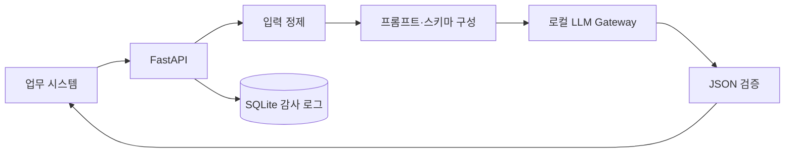

# 범용 sLLM JSON API와 VOC 위험도 평가

업무 시스템에서 로컬 LLM을 공통으로 호출할 수 있도록 만든 API입니다. 호출자가 역할 지시문, 입력 데이터, 응답 스키마를 전달하면 모델 응답을 JSON으로 검증해 반환합니다.

2025년 사내 AI 경진 과제로 개발했습니다. API 설계, 입력 정제, JSON 응답 보정, 재시도, 처리 로그, 배치 평가와 프롬프트 비교를 담당했습니다.

## 해결하려던 문제

각 업무 화면에서 모델을 직접 호출하면 프롬프트 형식, 오류 처리, 로그가 제각각이 됩니다. 모델 호출을 하나의 API로 모으고 다음 규칙을 공통 적용했습니다.

- HTML, Base64 이미지, 제어문자와 과도한 공백 제거
- 입력 길이 제한으로 비정상 요청 방어
- 호출자가 요구한 키를 기준으로 JSON 응답 검증
- JSON 파싱 실패 시 제한된 횟수만 재시도
- 원문 대신 해시와 길이를 남기는 감사 로그
- 허용된 모델만 선택할 수 있는 모델 정책

## 구조



## 구현 내용

### 범용 JSON API

업무별 프롬프트를 서버 코드에 고정하지 않고 요청으로 받습니다. 응답 키와 타입을 제한된 스키마로 정의하고, 모델이 설명 문장이나 코드 블록을 섞어 반환하면 실패로 처리합니다.

### 방어적 입력 정제

스크립트·스타일 태그, HTML 태그, 인라인 Base64 이미지와 제어문자를 제거합니다. 정제 후 내용이 없으면 모델을 호출하지 않습니다.

### 운영 로그

요청 원문과 모델 응답 전문은 저장하지 않습니다. 요청 해시, 문자 수, 모델, 성공 여부, 처리시간, 재시도 횟수만 남겨 성능과 장애를 확인할 수 있게 했습니다.

### VOC 위험도 평가

사람이 부여한 장애 중요도와 네 가지 프롬프트 버전의 결과를 비교했습니다. 200건 데이터에서 상관계수, MAE, RMSE, 4단계 정확도, QWK, Critical 재현율을 함께 보고 최종 프롬프트를 선정했습니다.

| 버전 | Pearson r | MAE | 4단계 정확도 | QWK | Critical 재현율 |
|---|---:|---:|---:|---:|---:|
| V1 | 0.428 | 30.25 | 29.0% | 0.372 | 17.4% |
| V2 | 0.808 | 13.48 | 69.5% | 0.796 | 81.2% |
| V3 | 0.922 | 8.30 | 73.5% | 0.894 | 79.7% |
| V4 | 0.890 | 9.74 | 69.5% | 0.867 | 78.3% |

V3는 전체 오차와 등급 일치도가 가장 좋았습니다. V2는 Critical 탐지는 높았지만 과대 경보가 많아 운영 피로도가 커질 수 있다고 판단했습니다. 상세 내용은 [모델 평가](docs/MODEL-EVALUATION.md)에 정리했습니다.

### 일괄 평가와 재실행

여러 VOC를 평가할 때 건별 결과를 체크포인트로 저장했습니다. 재실행 시 완료 건은 건너뛰고, 한 건의 API 오류가 나머지 평가를 중단하지 않게 처리했습니다. 공개 예제는 [BatchProcessor](app/batch.py), 설계 내용은 [일괄 평가 파이프라인](docs/BATCH-PIPELINE.md)에 있습니다.

## 실행

```bash
python -m venv .venv
source .venv/bin/activate
pip install -e .
uvicorn app.api:app --reload
```

Ollama가 실행 중이고 `llama3` 모델을 사용할 수 있어야 합니다. 기본 허용 모델은 환경변수 `ALLOWED_MODELS`로 변경할 수 있습니다.

```bash
python -m unittest discover -s tests -v
```

## 공개 범위

회사 VOC 원문, 실제 프롬프트, 모델 응답, SQLite 로그 DB와 내부 주소는 포함하지 않았습니다. 코드는 프로젝트에서 검증한 처리 흐름을 기준으로 공개용으로 다시 작성했습니다.

